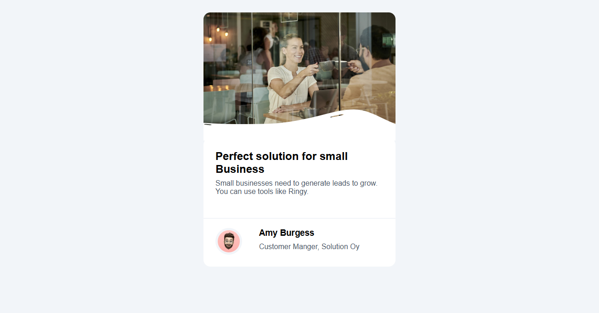

<h1 align="center">Business Blog Minimalist | devChallenges</h1>

<div align="center">
   Solution for a challenge <a href="https://devchallenges.io/challenge/business-blog-card" target="_blank">Business Blog Card</a> from <a href="http://devchallenges.io" target="_blank">devChallenges.io</a>.
</div>

<div align="center">
  <h3>
    <a href="https://business-card-blog.vercel.app/">`
      Demo
    </a>
    <span> | </span>
    <a href="https://business-card-blog.vercel.app/">
      Solution
    </a>
    <span> | </span>
    <a href="https://devchallenges.io/challenge/business-blog-card">
      Challenge
    </a>
  </h3>
</div>

<!-- TABLE OF CONTENTS -->

## Table of Contents

- [Overview](#overview)
  - [What I learned](#what-i-learned)
- [Built with](#built-with)
- [Features](#features)
- [Contact](#contact)
- [Acknowledgements](#acknowledgements)

<!-- OVERVIEW -->

## Overview



<p>En esta pagina encontraran una tarjeta minimalista sobre negocios.</p>

### What I learned

<p>Pude aprender a trabajar de manera mas eficiente, anteriormente realizaba ejercicios puestos por mi mismo sin rumbo alguno, con estos proyectos puedo aprender de manera precisa y objetiva con desafios de manera correcta. Aprendi a realizar un sitio mas ordenado y limpio para que sea comodo para el usuario. Aprendi a usar distintas herramientas en html y css.</p> 
````

### Built with

<!-- This section should list any major frameworks that you built your project using. Here are a few examples.-->

- Semantic HTML5 markup
- CSS custom properties
- Flexbox
- CSS Grid

## Features

En mi proyecto se encuentra el uso de HTML para una mejor accesibilidad y SEO. Diseño adaptable a móviles, tabletas y computadoras. Despliegue en Netlify para acceso en línea.
This application/site was created as a submission to a [DevChallenges](https://devchallenges.io/challenges-dashboard) challenge.

## Acknowledgements

DevChallenges.io me apoyo a poder aprender mas y de forma mas formal. Mimo.org me apoyo a aprender despacio y sencillo y algunos tutoriales de youtube e instagram.

## Author

- Website [your-website.com](https://business-card-blog.vercel.app/)
- GitHub [@your-username](https://github.com/S-arz84)